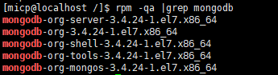
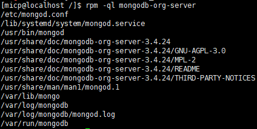
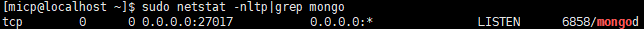
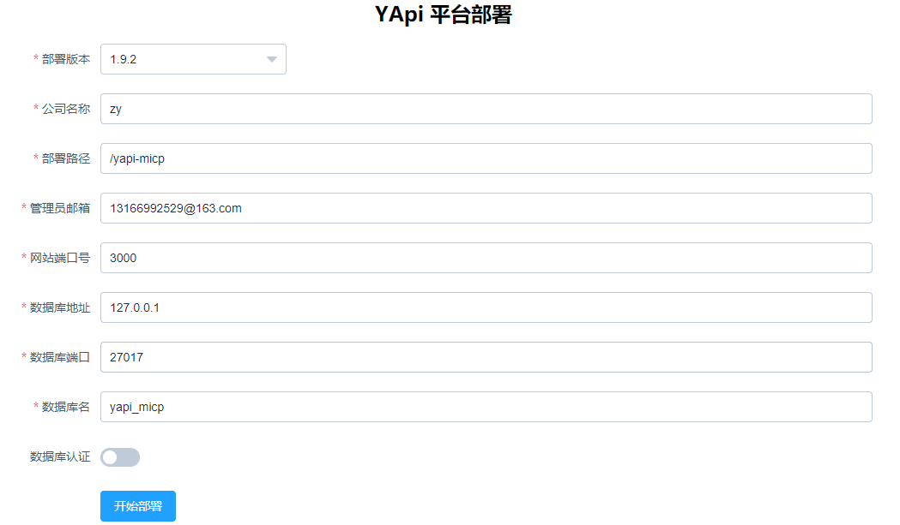
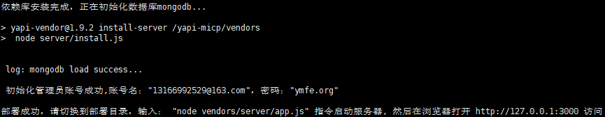
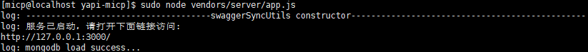
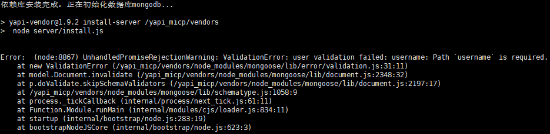

# Linux环境上部署Yapi
### 环境要求
- nodejs(7.6+)
- mongodb(2.6+)


## 安装node(10.23)
### 安装nodejs
```shell
# curl --silent --location https://rpm.nodesource.com/setup_10.x | sudo bash
# sudo yum -y install nodejs
```


## 安装mongodb(3.4)
### 创建仓库
```shell
# vim /etc/yum.repos.d/mongodb-org-3.4.repo
```

### 添加内容到文件中 保存退出
```vim
[mongodb-org-3.4]
name=MongoDB Repository
baseurl=https://repo.mongodb.org/yum/redhat/$releasever/mongodb-org/3.4/x86_64/
gpgcheck=1
enabled=1
gpgkey=https://www.mongodb.org/static/pgp/server-3.4.asc
```

### 安装mongodb
```shell
# yum install -y mongodb-org
```

### 验证安装结果
```shell
# rpm -qa |grep mongodb
```

```shell
# rpm -ql mongodb-org-server
```


### 修改配置文件
把bindIP改成 0.0.0.0所有的机器都可以访问
```shell
# vim /etc/mongod.conf
```

### 启动关闭mongo服务
```shell
# service mongod start
# service mongod stop
```

### 查看mongo服务
```shell
# sudo netstat -nltp|grep mongo
```

### 链接本地mongodb
```shell
# mongo 127.0.0.1:27017 
```


## 安装Yapi
### 安装yapi-cli
```shell
# sudo npm install -g yapi-cli --registry https://registry.npm.taobao.org
```


### 可视化部署
浏览器访问：172.16.5.71:9090
```shell
# sudo /usr/bin/yapi server
```

默认管理员账号：部署时的管理员邮箱，默认管理员密码：ymfe.org


### 启用服务
```shell
# sudo node /yapi-micp/vendors/server/app.js
```
浏览器访问：172.16.5.71:3000


### 后台运行yapi
上面的方式当关闭ssh窗口时yapi服务也会停止，可以使用pm2管理，保持后台运行状态.

#### 安装pm2
```shell
# sudo npm install -g pm2
```

#### 启动
```shell
# sudo pm2 start /yapi-micp/vendors/server/app.js
```

#### 关闭
```shell
# sudo pm2 stop /yapi-micp/vendors/server/app.js
```

### 问题
可视化部署时添加的管理员邮箱未按照邮箱格式填写
